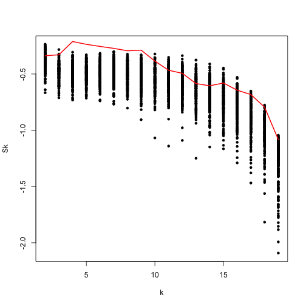
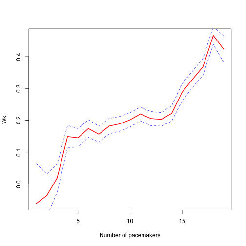

ClockstaRG
===========

This is the repository for ClockstaRG, an implementation of [ClockstaR](https://github.com/sebastianduchene/clockstar) for large data sets. This program only works in Unix-like machines, and it is more difficult to use than ClockstaR. For data sets with fewer than 20 genes, I suggest using the starndard version of ClockstaR.

Please follow the tutorial below for instructions on how to use:

The program can be installed directly from github. This requres the devtools package, which can be downlaoded from CRAN.

```
install.packages(devtools)
```

Install ClockstaRG:

```
install_github('clockstarg', 'sebastianduchene')
```

If all goes well, you should be able to load ClockstaRG

```
library(ClockstaRG)
```

ClockstaRG is run through a series of steps. Download this repository as a zip file and unzip it. A folder called *test_files* contains some simulated data for this tutorial. It is a fairly small data set, so it should run very quickly.

1. Optimise branch lengths for the gene trees
---------------------------------------------

Create a folder and move the *test_files* folder to the new folder.
 
Open two sessions of R and set the working directory to the folder you just created. Load ClockstaRG and in type the following in each session:

```
optim.trees.g(data.folder = 'test_files', init.alin = 1, end.alin = 10, out.trees = '../out_trees_1.trees', model.test = F)
```

```
optim.trees.g(data.folder = 'test_files', init.alin = 11, end.alin = 20, out.trees = '../out_trees_2.trees', model.test = F)
```

There are 20 genes in the data set. Each session will optimise 10, as specified in the init.alin and end.alin parameters in the optim.trees.g function.

After the sessions finish optimising the branch lengths, two files will appear in the working directory; out_trees_1.trees, and out_trees_2.trees. These files contain the gene trees. Concatenate them through R using a shell command with the function system(). You can also use the shell command directly.

```
system('cat out_trees_*.trees > out_trees_all.trees')
```

2. Make tree comparissons files
-------------------------------

ClockstaRG requires a file with the names of all the trees for which it needs to estimate the *sBSDmin* tree distance ([Duchene et al. 2014](#references)). Make the file with the following command:

```
make.tree.comps(trees.file = 'out_trees_all.trees', tree.comps = 'tree_comparisons.txt')
```

This will make a file called *tree_comparissons.txt*. Each line corresponds to the tree names for each *sBSDmin* distance to estimate.


3. Estimate *sBSDmin* for a range of trees
------------------------------------------

The function *get.sbsd* uses the file with the gene trees (*out_trees_all.trees*) and the tree comparissons file (*tree_comparissons.txt*) to estimate the *sBSDmin* for pairs of trees.

Open two R sessions (if you had not done this prevously), and use type the following lines in each session:

```
get.sbsd(trees.file = 'out_trees_all.trees', comps.file = 'tree_comparisons.txt', method = 'memory', range.comps = 1:95, out.file = 'sbsd_1.txt')
```

```
get.sbsd(trees.file = 'out_trees_all.trees', comps.file = 'tree_comparisons.txt', method = 'memory', range.comps = 96:190, out.file = 'sbsd_2.txt')
```

The numbers in range.comps are the range of distances to estimate. These correspond to the lines in the *tree_comparissons.txt* file.Note that in each session we are running a set of values. Type ?get.sbsd at the prompt for more information on other function arguments. The argument *method* is particularly important. It can be used to read trees one at a time (lite), or to load them in memory (memory). Selecting *memory* is faster, but if there is not enough RAM available for the data set, *lite* is a more efficient option.

In this step we produced two files with the *sBSDmin* distances. These should be combined, with a shell command. Use *system* from R to combine the files:

```
system('cat sbsd_*.txt > sbsd_all.txt')
```

4. Fold the *sBSDmin* distances into a pariwise matrix
------------------------------------------------------

If you open the *sbsd_all.txt* file in a text editor, you will notice that the values are printed line by line. For the subsequent steps it is necessary to format these distances into a pairwise matrix. This can be done using two functions: *fold.sbsd* and *fill.matrix*. 
*fold.sbsd* folds the scaling factors,*s*, and the *sBSDmin* distances:

```
fold.sbsd(trees.file = 'out_trees_all.trees', comps.file = 'sbsd_all.txt', out.name = 'folded_sbsd.txt', method = 'lite')
```

*fold.sbsd* produced two files: *sbsdfolded_sbsd.txt* and *sfolded_sbsd.txt*. These are pairwise matrices, but the above diagonal alements are NA. Some clusering applications require the above diagonal elements as numbers. This can be done with the *fill.matrix* function:

```
fill.matrix(matrix.name = 'sbsdfolded_sbsd.txt')
fill.matrix(matrix.name = 'sfolded_sbsd.txt')
```

This will fill the upper diagonal elements and store them in the same text files.

5. Multi-dimensional scaling (MDS) of the pairwise matrices
-----------------------------------------------------

ClockstaRG uses CLARA and a paramtric bootstrapping method. In these methods we cannot use the pairwise distances directly, so we use a multi-dimensional scaling (MDS) of the *sBSDmin* distances. This can be done with the *run.mds* function:

```
run.mds(matrix.name = 'sbsdfolded_sbsd.txt', out.mds.name = 'sbsd_mds.txt')
```

The argumensts are the name of the pairwise *sBSDmin* distances and the name of the output file. Note that we use the *sBSDmin* distance, instead of the scaling factors, *s*. The scaling factors are not used for the clusteing algorithm, but they can be used to compare the relative rates among genes.


6. Run the clustering algorithm 
-------------------------------

The following functions can be used to estimate the average silhouette width and the average cluster width. I find that the silhouette width works better for large data sets, but this warrants further investigation.

For the purpose of this tutorial we can run them both to compare the results:

Type the following lines in each of the R prompts that you opened previously:

````
run.clara.sil(clus.matrix.name = 'points_sbsd_mds.txt', out.clus.name = 'out_clus_sil.txt')
```

```
run.clara.wk(clus.matrix.name = 'points_sbsd_mds.txt', out.clus.name = 'out_clus_wk.txt')
````


7. Bootstrapping 
----------------

A parametric bootstrap is necessary to assess statistical support for values of *k*. This can be done with the *boot.clara* function. Because bootstrap replicates are independent, a set of replicates can be run in different machines or instances of R to increase speed.

The function *bot.clara* requires the name of the MDS coordinates (from step 5) the name of the output file, and the clustering function for the bootstrap replicates. Use the help for this function for details on the arguments (?boot.clara). On this case, we will run it for both clustering algorithms, average silhouette width and average cluster width. 

```
boot.clara(clus.matrix.name = 'points_sbsd_mds.txt', nboot = 100, FUNboot = run.clara.sil, out.boot.name = 'out_boot_sil.txt')
```
```
boot.clara(clus.matrix.name = 'points_sbsd_mds.txt', nboot = 100, FUNboot = run.clara.wk, out.boot.name = 'out_boot_wk.txt')
```

8. Plotting and viewing the results
-----------------------------------

There are many ways to plot the results. A simple example is shown below.

The files *out_boot_sil.txt* and *out_boot_wk.txt* contain the bootstrap replicates with the silhouette and cluster width algorithms. The estimates for the real data are in *out_clus_sil.txt* and *out_clus_wk.txt*. The first column is the number of pacemakers (*k*) and the second is the statistic computed (average silhouette width or average cluster width).

For the silhouette width we select the maximum increase in the statistic between sucessive values of *k*. We only consider values higher than all the bootstrap replicates ([Duchene & Ho, Submitted](#references)).


```r
boot_sil <- read.table('out_boot_sil.txt', head = F, as.is = T)
plot(boot_sil[, 1], boot_sil[, 2], pch = 20,  ylab = 'Sk', xlab = 'Number of pacemakers')

cluster_sil <- read.table('out_clus_sil.txt', head = F, as.is = T)
lines(cluster_sil[, 1], cluster_sil[, 2], col = 'red', lwd = 2)
```

 


For the cluster width it is necessary to compute the GAP statistic. This can be done with the function *get.gap*. The optimal value is the first maximum. 


```r
boot_wk <- read.table('out_boot_wk.txt', head = F, as.is = T)

cluster_wk <- read.table('out_clus_wk.txt', head = F, as.is = T)

gap <- get.gap(true.data = cluster_wk, boot.data = boot_wk)

plot(gap[, 1], type = 'l', col = 'red', lwd = 2, ylab = 'Wk', xlab = 'Number of pacemakers')
lines(gap[, 1] + gap[, 2], col = 'blue', lty = 2)
lines(gap[, 1] - gap[, 2], col = 'blue', lty = 2)
```

 

Note that with both methods the optimal number of pacemakers is four.


References
----------

Duchene, S., Molak, M., & Ho, S. Y. (2014b). ClockstaR: choosing the number of relaxed-clock models in molecular phylogenetic analysis. *Bioinformatics* 30 (7): 1017-1019.

Duchene, S. & Ho, S. Y. (Submitted)
