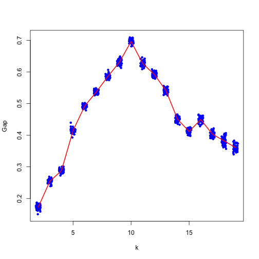
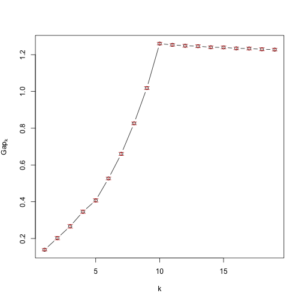

# ClockstaR-G


This is the repository for ClockstaR-G, an implementation of [ClockstaR](https://github.com/sebastianduchene/clockstar) for large data sets. It is more difficult to use than ClockstaR. For data sets with fewer than 20 genes, I suggest using the starndard version of ClockstaR.

Please follow the tutorial below for instructions on how to use. It assumes some basic R knowledge:

The program can be installed directly from github. This requres the devtools package, which can be downlaoded from CRAN. 


```
install.packages('devtools')
library(devtools)
```

devtools has a function to download packages directly from github. This can be used to download ClockstaR and ClockstaR-G:

```
install_github('sebastianduchene/clockstar')
install_github('sebastianduchene/clockstarg')
```

Load ClockstaR-G. This will automatically load any necessary dependencies:


```r
library(ClockstaRG)
```

In this example we will use a simulated data set from Duchene and Ho (Pending.). This data sets consists of 431 genes with 10 pacemakers. To see the data download this repository by clicking on 'Download as a zip file' on the right of this page. After downloading the zip file, uncompress it and open the folder called test_files. It contains 431 fasta files, for each individual gene, one the gene tree topology (tree_topo.tree), and the individual gene trees (gene_trs.trees). 

The trees are in newick format. The gene trees are obtained by optimising the branch lengths of the tree topology for each gene, such that all gene trees have the same topology but different branch lengths. 

Open one of the fasta files, tree_topo.tree, and gene_trs.trees in a text editor. Note that tree_topo.tree contains a single tree. The branch lengths are arbitrary and are only used as stsrting values in the optimisation. gene_trs.trees contains 431 trees. The names of the trees correspond to the individual genes.

ClockstaR-G does not estimate the gene trees, but these can also be obtained from R by using the ClockstaR2 function optim.trees.interactive(). This can be slow for large data sets, so it is usually better to use other programs, such as GARLI or RaXML. If the data set is not very large, type the code below in the prompt and follow the instructions. However, this would take very long for this tutorial, so we will skip this step.

```
optim.trees.interactive()
```

The gene trees can be read into R and stored in 'gene_trees' using the following code. It is important to make sure that the format matches that of the example file here, including the gene names for each of the gene trees.


```r
gene_trees <- read.tree('test_files/gene_trs.trees')
gene_trees
```

```
## 431 phylogenetic trees
```

The next step is to make a matrix where the rows are the individual gene trees, and the columns are the scaled branch lengths. This can be done using the code below:


```r
scaled_brlens <- get_scaled_brs(gene_trees)
```

The matrix is called 'scaled_brlens'. To inspect it use the code below:


```r
scaled_brlens[1:5, 1:5]
```

```
##                      br1         br2         br3        br4        br5
## gene1.fasta    0.8744534 -0.94391517 -0.30614258 -0.7547649 -0.9224694
## gene10.fasta  -0.1115978 -0.64901645  0.34732223 -1.2503996  1.6364791
## gene100.fasta  0.5661995 -1.52203349 -0.66338113  0.6159581  1.9645646
## gene101.fasta  1.3220140 -0.11418356 -0.37096590  0.2638443 -0.9959751
## gene102.fasta -0.1406745  0.04542243 -0.02738257  1.8221301  2.1470487
```

```r
dim(scaled_brlens)
```

```
## [1] 431  55
```

The final step is to run the clustering algorithm. There are many different algorithms, and in some cases the results can differ. ClockstaR and ClockstaR-G use the Gap statistic, which appears to perform well for phylogenetic trees. 

To select the optimal number of pacemakers for this data, use the function optim_clusters_coord. This function takes several arguments:

- **scaled_brlens:** The matrix with scaled branch lengths obtained above.

- **n_clusters:** This is the number of computing clusters. Not to be confused with the number of clusters in the data. In multicore machines this can considerably reduce computation time. In this example we use 2 computing clusters.

- **kmax:** This is the maximum number of pacemakers to fit to the data. This should be an integer of maximum N-1. Using large numbers of N for large data sets can take a long time. 

- **b_reps:** Number of bootstrap replicates. In this example. 

- **out_cluster_id:** Name of the file to save the cluster assignment.

- **out_cluster_info:** Name of the file to save cluster information, this is cluster size, maximum dissimilarity, average dissimilarity, and isolation.

- **out_gap_stats:** Name of file to save the gap statistics.

- **plot_clustering:** Use T to print the Gap statistics in the current graphics device.
 


```r
pms_gap <- optim_clusters_coord(scaled_brlens, n_clusters = 2, kmax = 19, b_reps = 50, out_cluster_id = 'cluster_id.txt', out_cluster_info = 'cluster_info.txt', out_gap_stats = 'gap_stats.txt', plot_clustering = T)
```

```
## bootstrap replicate 1 the average silhouete width is 0.01842802 
## bootstrap replicate 2 the average silhouete width is 0.01650962 
## bootstrap replicate 3 the average silhouete width is 0.02344216 
## bootstrap replicate 4 the average silhouete width is 0.01623518 
## bootstrap replicate 5 the average silhouete width is 0.01917889 
## bootstrap replicate 6 the average silhouete width is 0.02372535 
## bootstrap replicate 7 the average silhouete width is 0.01674285 
## bootstrap replicate 8 the average silhouete width is 0.0244366 
## bootstrap replicate 9 the average silhouete width is 0.02083868 
## bootstrap replicate 10 the average silhouete width is 0.02017217 
## bootstrap replicate 11 the average silhouete width is 0.02074904 
## bootstrap replicate 12 the average silhouete width is 0.01423596 

...
```

 


The plot shows the maximum Gap for the optimal *k*. Open the files 'cluster_id.txt', 'cluster_info.txt', and 'gap_stats.txt' in a text editor to see the results. They can also be inspected by looking at the items stored in pms_gap:


```r
pms_gap$optimal_k
```

```
## [1] 10
```

```r
pms_gap$cluster_info
```

```
##       size max_diss  av_diss isolation
##  [1,]   44 2.872802 1.738623 0.3041848
##  [2,]   43 3.562964 1.931214 0.3772621
##  [3,]   43 3.925070 2.751087 0.4003564
##  [4,]   43 2.886371 1.813477 0.3253930
##  [5,]   43 3.832125 2.175079 0.4359790
##  [6,]   43 3.937764 2.433356 0.4101754
##  [7,]   43 3.902511 2.169332 0.4399468
##  [8,]   43 3.264329 1.937136 0.3713812
##  [9,]   43 4.237605 2.445618 0.4560646
## [10,]   43 3.641381 2.053959 0.3658634
```

```r
pms_gap$cluster_id
```

```
##   gene1.fasta  gene10.fasta gene100.fasta gene101.fasta gene102.fasta 
##             1             2             3             4             5 
## gene103.fasta gene104.fasta gene105.fasta gene106.fasta gene107.fasta 
##             6             7             8             9            10 
## gene108.fasta gene109.fasta  gene11.fasta gene110.fasta gene111.fasta 
##             1             2             3             4             5 
## gene112.fasta gene113.fasta gene114.fasta gene115.fasta gene116.fasta 
##             6             7             8             9            10 
## gene117.fasta gene118.fasta gene119.fasta  gene12.fasta gene120.fasta 
##             1             2             3             4             5 
## gene122.fasta gene123.fasta gene124.fasta gene125.fasta gene126.fasta 
##             6             7             8             9            10 
## gene127.fasta gene128.fasta gene129.fasta  gene13.fasta gene130.fasta 
##             1             2             3             4             5 
```


Alternatively, it is possible to use the function clusGap from the cluster package as shown below. To find out how to use this function use ?clusGap.


```r
pms_pam_cluster <- clusGap(scaled_brlens, FUNcluster = clara, K.max = 19, B = 50)
```

```
## Clustering k = 1,2,..., K.max (= 19): .. done
## Bootstrapping, b = 1,2,..., B (= 50)  [one "." per sample]:
## .................................................. 50
```

```r
plot(pms_pam_cluster)
```

 


#References

Duchene, S., Molak, M., & Ho, S. Y. W. (2014) ClockstaR: choosing the number of relaxed-clock models in molecular phylogenetic analysis. *Bioinformatics* 30 (7): 1017-1019.

Duchene, S. & Ho, S. Y. W. (Submitted)
