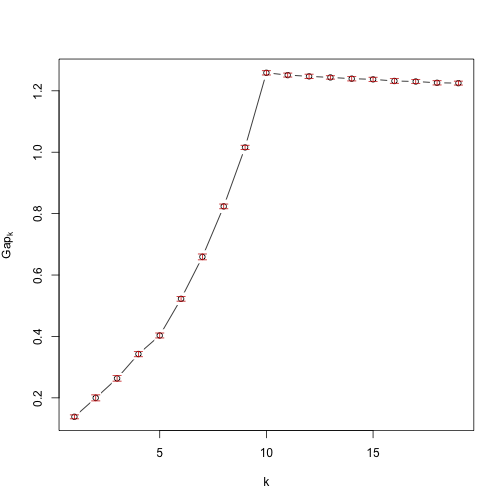

# ClockstaR-G


This is the repository for ClockstaR-G, an implementation of [ClockstaR](https://github.com/sebastianduchene/clockstar) for large data sets. It is more difficult to use than ClockstaR. For data sets with fewer than 20 genes, I suggest using the starndard version of ClockstaR.

Please follow the tutorial below for instructions on how to use. It assumes some basic R knowledge:

The program can be installed directly from github. This requres the devtools package, which can be downlaoded from CRAN. 


```
install.packages('devtools')
library(devtools)
```

devtools has a function to download packages directly from github. This can be used to download ClockstaR and ClockstaR-G:

```
install_github('sebastianduchene/clockstar')
install_github('sebastianduchene/clockstarg')
```

Load ClockstaR-G. This will automatically load any necessary dependencies:


```r
library(ClockstaRG)
```

In this example we will use a simulated data set from Duchene and Ho (Pending.). This data sets consists of 431 genes with 10 pacemakers. To see the data download this repository by clicking on 'Download as a zip file' on the right of this page. After downloading the zip file, uncompress it and open the folder called test_files. It contains 431 fasta files, for each individual gene, one the gene tree topology (tree_topo.tree), and the individual gene trees (gene_trs.trees). 

The trees are in newick format. The gene trees are obtained by optimising the branch lengths of the tree topology for each gene, such that all gene trees have the same topology but different branch lengths. 

Open one of the fasta files, tree_topo.tree, and gene_trs.trees in a text editor. Note that tree_topo.tree contains a single tree. The branch lengths are arbitrary and are only used as stsrting values in the optimisation. gene_trs.trees contains 431 trees. The names of the trees correspond to the individual genes.

ClockstaR-G does not estimate the gene trees, but these can also be obtained from R by using the ClockstaR2 function optim.trees.interactive(). This can be slow for large data sets, so it is usually better to use other programs, such as GARLI or RaXML. If the data set is not very large, type the code below in the prompt and follow the instructions. However, this would take very long for this tutorial, so we will skip this step.

```
optim.trees.interactive()
```

The gene trees can be read into R and stored in 'gene_trees' using the following code. It is important to make sure that the format matches that of the example file here, including the gene names for each of the gene trees.


```r
gene_trees <- read.tree('test_files/gene_trs.trees')
gene_trees
```

```
## 431 phylogenetic trees
```

The next step is to make a matrix where the rows are the individual gene trees, and the columns are the scaled branch lengths. This can be done using the code below:


```r
scaled_brlens <- get_scaled_brs(gene_trees)
```

The matrix is called 'scaled_brlens'. To inspect it use the code below:


```r
scaled_brlens[1:5, 1:5]
```

```
##                      br1         br2         br3        br4        br5
## gene1.fasta    0.8744534 -0.94391517 -0.30614258 -0.7547649 -0.9224694
## gene10.fasta  -0.1115978 -0.64901645  0.34732223 -1.2503996  1.6364791
## gene100.fasta  0.5661995 -1.52203349 -0.66338113  0.6159581  1.9645646
## gene101.fasta  1.3220140 -0.11418356 -0.37096590  0.2638443 -0.9959751
## gene102.fasta -0.1406745  0.04542243 -0.02738257  1.8221301  2.1470487
```

```r
dim(scaled_brlens)
```

```
## [1] 431  55
```

The final step is to run the clustering algorithm. There are many different algorithms, and in some cases the results can differ. ClockstaR and ClockstaR-G use the Gap statistic, which appears to perform well for phylogenetic trees. 

To select the optimal number of pacemakers for this data, use the function optim_clusters_coord. This function takes several arguments:

- scaled_brlens: The matrix with scaled branch lengths obtained above.

- n_clusters: This is the number of computing clusters. Not to be confused with the number of clusters in the data. In multicore machines this can considerably reduce computation time. In this example we use 2 computing clusters.

- kmax: This is the maximum number of pacemakers to fit to the data. This should be an integer of maximum N-1. Using large numbers of N for large data sets can take a long time. 

- b_reps: Number of bootstrap replicates. In this example. 

- out_cluster_id: Name of the file to save the cluster assignment.

- out_cluster_info: Name of the file to save cluster information, this is cluster size, maximum dissimilarity, average dissimilarity, and isolation.

- out_gap_stats: Name of file to save the gap statistics.

- plot_clustering: Use T to print the Gap statistics in the current graphics device.
 


```r
pms_gap <- optim_clusters_coord(scaled_brlens, n_clusters = 2, kmax = 19, b_reps = 50, out_cluster_id = 'cluster_id.txt', out_cluster_info = 'cluster_info.txt', out_gap_stats = 'gap_stats.txt', plot_clustering = T)
```

```
## bootstrap replicate 1 the average silhouete width is 0.01842802 
## bootstrap replicate 2 the average silhouete width is 0.01650962 
## bootstrap replicate 3 the average silhouete width is 0.02344216 
## bootstrap replicate 4 the average silhouete width is 0.01623518 
## bootstrap replicate 5 the average silhouete width is 0.01917889 
## bootstrap replicate 6 the average silhouete width is 0.02372535 
## bootstrap replicate 7 the average silhouete width is 0.01674285 
## bootstrap replicate 8 the average silhouete width is 0.0244366 
## bootstrap replicate 9 the average silhouete width is 0.02083868 
## bootstrap replicate 10 the average silhouete width is 0.02017217 
## bootstrap replicate 11 the average silhouete width is 0.02074904 
## bootstrap replicate 12 the average silhouete width is 0.01423596 
## bootstrap replicate 13 the average silhouete width is 0.02281579 
## bootstrap replicate 14 the average silhouete width is 0.01988809 
## bootstrap replicate 15 the average silhouete width is 0.01382473 
## bootstrap replicate 16 the average silhouete width is 0.01751823 
## bootstrap replicate 17 the average silhouete width is 0.02138685 
## bootstrap replicate 18 the average silhouete width is 0.01583813 
## bootstrap replicate 19 the average silhouete width is 0.02547178 
## bootstrap replicate 20 the average silhouete width is 0.01532817 
## bootstrap replicate 21 the average silhouete width is 0.01710071 
## bootstrap replicate 22 the average silhouete width is 0.01849372 
## bootstrap replicate 23 the average silhouete width is 0.01565379 
## bootstrap replicate 24 the average silhouete width is 0.01633723 
## bootstrap replicate 25 the average silhouete width is 0.01586342 
## bootstrap replicate 26 the average silhouete width is 0.02310333 
## bootstrap replicate 27 the average silhouete width is 0.02572832 
## bootstrap replicate 28 the average silhouete width is 0.01518733 
## bootstrap replicate 29 the average silhouete width is 0.01111652 
## bootstrap replicate 30 the average silhouete width is 0.01729826 
## bootstrap replicate 31 the average silhouete width is 0.0193187 
## bootstrap replicate 32 the average silhouete width is 0.02020221 
## bootstrap replicate 33 the average silhouete width is 0.01855755 
## bootstrap replicate 34 the average silhouete width is 0.02066639 
## bootstrap replicate 35 the average silhouete width is 0.01380485 
## bootstrap replicate 36 the average silhouete width is 0.02077341 
## bootstrap replicate 37 the average silhouete width is 0.02158177 
## bootstrap replicate 38 the average silhouete width is 0.02014206 
## bootstrap replicate 39 the average silhouete width is 0.01596045 
## bootstrap replicate 40 the average silhouete width is 0.01409982 
## bootstrap replicate 41 the average silhouete width is 0.02168796 
## bootstrap replicate 42 the average silhouete width is 0.01922657 
## bootstrap replicate 43 the average silhouete width is 0.02103089 
## bootstrap replicate 44 the average silhouete width is 0.01795039 
## bootstrap replicate 45 the average silhouete width is 0.01963858 
## bootstrap replicate 46 the average silhouete width is 0.02055164 
## bootstrap replicate 47 the average silhouete width is 0.01848333 
## bootstrap replicate 48 the average silhouete width is 0.01761819 
## bootstrap replicate 49 the average silhouete width is 0.0108715 
## bootstrap replicate 50 the average silhouete width is 0.01823451
```

 


The plot shows the maximum Gap for the optimal *k*. Open the files 'cluster_id.txt', 'cluster_info.txt', and 'gap_stats.txt' in a text editor to see the results. They can also be inspected by looking at the items stored in pms_gap:


```r
pms_gap$optimal_k
```

```
## [1] 10
```

```r
pms_gap$cluster_info
```

```
##       size max_diss  av_diss isolation
##  [1,]   44 2.872802 1.738623 0.3041848
##  [2,]   43 3.562964 1.931214 0.3772621
##  [3,]   43 3.925070 2.751087 0.4003564
##  [4,]   43 2.886371 1.813477 0.3253930
##  [5,]   43 3.832125 2.175079 0.4359790
##  [6,]   43 3.937764 2.433356 0.4101754
##  [7,]   43 3.902511 2.169332 0.4399468
##  [8,]   43 3.264329 1.937136 0.3713812
##  [9,]   43 4.237605 2.445618 0.4560646
## [10,]   43 3.641381 2.053959 0.3658634
```

```r
pms_gap$cluster_id
```

```
##   gene1.fasta  gene10.fasta gene100.fasta gene101.fasta gene102.fasta 
##             1             2             3             4             5 
## gene103.fasta gene104.fasta gene105.fasta gene106.fasta gene107.fasta 
##             6             7             8             9            10 
## gene108.fasta gene109.fasta  gene11.fasta gene110.fasta gene111.fasta 
##             1             2             3             4             5 
## gene112.fasta gene113.fasta gene114.fasta gene115.fasta gene116.fasta 
##             6             7             8             9            10 
## gene117.fasta gene118.fasta gene119.fasta  gene12.fasta gene120.fasta 
##             1             2             3             4             5 
## gene122.fasta gene123.fasta gene124.fasta gene125.fasta gene126.fasta 
##             6             7             8             9            10 
## gene127.fasta gene128.fasta gene129.fasta  gene13.fasta gene130.fasta 
##             1             2             3             4             5 
## gene131.fasta gene132.fasta gene134.fasta gene137.fasta gene138.fasta 
##             6             7             8             9            10 
## gene139.fasta  gene14.fasta gene140.fasta gene141.fasta gene142.fasta 
##             1             2             3             4             5 
## gene143.fasta gene144.fasta gene145.fasta gene146.fasta gene147.fasta 
##             6             7             8             9            10 
## gene148.fasta  gene15.fasta gene150.fasta gene151.fasta gene152.fasta 
##             1             2             3             4             5 
## gene153.fasta gene154.fasta gene155.fasta gene156.fasta gene157.fasta 
##             6             7             8             9            10 
## gene158.fasta gene159.fasta  gene16.fasta gene161.fasta gene162.fasta 
##             1             2             3             4             5 
## gene163.fasta gene164.fasta gene165.fasta gene166.fasta gene167.fasta 
##             6             7             8             9            10 
## gene168.fasta gene169.fasta  gene17.fasta gene170.fasta gene171.fasta 
##             1             2             3             4             5 
## gene172.fasta gene173.fasta gene174.fasta gene175.fasta gene176.fasta 
##             6             7             8             9            10 
## gene177.fasta gene178.fasta gene179.fasta  gene18.fasta gene180.fasta 
##             1             2             3             4             5 
## gene181.fasta gene182.fasta gene183.fasta gene184.fasta gene185.fasta 
##             6             7             8             9            10 
## gene188.fasta gene189.fasta  gene19.fasta gene190.fasta gene191.fasta 
##             1             2             3             4             5 
## gene192.fasta gene193.fasta gene194.fasta gene195.fasta gene196.fasta 
##             6             7             8             9            10 
## gene197.fasta gene198.fasta gene199.fasta   gene2.fasta  gene20.fasta 
##             1             2             3             4             5 
## gene200.fasta gene201.fasta gene202.fasta gene203.fasta gene204.fasta 
##             6             7             8             9            10 
## gene205.fasta gene206.fasta gene207.fasta gene208.fasta gene209.fasta 
##             1             2             3             4             5 
##  gene21.fasta gene210.fasta gene211.fasta gene212.fasta gene213.fasta 
##             6             7             8             9            10 
## gene214.fasta gene215.fasta gene216.fasta gene217.fasta gene218.fasta 
##             1             2             3             4             5 
## gene219.fasta  gene22.fasta gene220.fasta gene221.fasta gene222.fasta 
##             6             7             8             9            10 
## gene223.fasta gene224.fasta gene225.fasta gene226.fasta gene227.fasta 
##             1             2             3             4             5 
## gene228.fasta gene229.fasta  gene23.fasta gene230.fasta gene231.fasta 
##             6             7             8             9            10 
## gene232.fasta gene233.fasta gene234.fasta gene235.fasta gene238.fasta 
##             1             2             3             4             5 
## gene239.fasta  gene24.fasta gene240.fasta gene241.fasta gene242.fasta 
##             6             7             8             9            10 
## gene243.fasta gene244.fasta gene245.fasta gene246.fasta gene247.fasta 
##             1             2             3             4             5 
## gene248.fasta gene249.fasta  gene25.fasta gene250.fasta gene251.fasta 
##             6             7             8             9            10 
## gene252.fasta gene253.fasta gene254.fasta gene255.fasta gene256.fasta 
##             1             2             3             4             5 
## gene257.fasta gene258.fasta gene259.fasta  gene26.fasta gene260.fasta 
##             6             7             8             9            10 
## gene261.fasta gene262.fasta gene263.fasta gene264.fasta gene265.fasta 
##             1             2             3             4             5 
## gene266.fasta gene267.fasta gene268.fasta gene269.fasta  gene27.fasta 
##             6             7             8             9            10 
## gene270.fasta gene271.fasta gene272.fasta gene273.fasta gene274.fasta 
##             1             2             3             4             5 
## gene275.fasta gene276.fasta gene277.fasta gene278.fasta gene279.fasta 
##             6             7             8             9            10 
##  gene28.fasta gene280.fasta gene281.fasta gene282.fasta gene283.fasta 
##             1             2             3             4             5 
## gene284.fasta gene285.fasta gene286.fasta gene287.fasta gene288.fasta 
##             6             7             8             9            10 
## gene289.fasta  gene29.fasta gene290.fasta gene291.fasta gene292.fasta 
##             1             2             3             4             5 
## gene293.fasta gene294.fasta gene295.fasta gene296.fasta gene297.fasta 
##             6             7             8             9            10 
## gene298.fasta gene299.fasta   gene3.fasta  gene30.fasta gene300.fasta 
##             1             2             3             4             5 
## gene301.fasta gene302.fasta gene303.fasta gene304.fasta gene305.fasta 
##             6             7             8             9            10 
## gene306.fasta gene307.fasta gene309.fasta  gene31.fasta gene310.fasta 
##             1             2             3             4             5 
## gene311.fasta gene312.fasta gene313.fasta gene314.fasta gene315.fasta 
##             6             7             8             9            10 
## gene316.fasta gene317.fasta gene318.fasta gene319.fasta  gene32.fasta 
##             1             2             3             4             5 
## gene320.fasta gene321.fasta gene322.fasta gene323.fasta gene324.fasta 
##             6             7             8             9            10 
## gene325.fasta gene326.fasta gene327.fasta gene328.fasta gene329.fasta 
##             1             2             3             4             5 
##  gene33.fasta gene330.fasta gene331.fasta gene332.fasta gene333.fasta 
##             6             7             8             9            10 
## gene334.fasta gene335.fasta gene336.fasta gene337.fasta gene338.fasta 
##             1             2             3             4             5 
## gene339.fasta  gene34.fasta gene340.fasta gene341.fasta gene342.fasta 
##             6             7             8             9            10 
## gene343.fasta gene344.fasta gene345.fasta gene346.fasta gene347.fasta 
##             1             2             3             4             5 
## gene348.fasta gene349.fasta  gene35.fasta gene350.fasta gene351.fasta 
##             6             7             8             9            10 
## gene352.fasta gene353.fasta gene354.fasta gene355.fasta gene356.fasta 
##             1             2             3             4             5 
## gene357.fasta gene358.fasta gene359.fasta  gene36.fasta gene360.fasta 
##             6             7             8             9            10 
## gene361.fasta gene362.fasta gene363.fasta gene364.fasta gene365.fasta 
##             1             2             3             4             5 
## gene366.fasta gene367.fasta gene368.fasta gene369.fasta  gene37.fasta 
##             6             7             8             9            10 
## gene370.fasta gene371.fasta gene372.fasta gene373.fasta gene374.fasta 
##             1             2             3             4             5 
## gene375.fasta gene376.fasta gene377.fasta gene378.fasta gene379.fasta 
##             6             7             8             9            10 
##  gene38.fasta gene380.fasta gene381.fasta gene382.fasta gene383.fasta 
##             1             2             3             4             5 
## gene384.fasta gene385.fasta gene386.fasta gene387.fasta gene388.fasta 
##             6             7             8             9            10 
## gene389.fasta  gene39.fasta gene390.fasta gene391.fasta gene392.fasta 
##             1             2             3             4             5 
## gene393.fasta gene394.fasta gene395.fasta gene396.fasta gene397.fasta 
##             6             7             8             9            10 
## gene398.fasta gene399.fasta   gene4.fasta  gene40.fasta gene400.fasta 
##             1             2             3             4             5 
## gene401.fasta gene402.fasta gene403.fasta gene404.fasta gene405.fasta 
##             6             7             8             9            10 
## gene406.fasta gene407.fasta gene408.fasta gene409.fasta  gene41.fasta 
##             1             2             3             4             5 
## gene410.fasta gene411.fasta gene412.fasta gene413.fasta gene415.fasta 
##             6             7             8             9            10 
## gene416.fasta gene417.fasta gene418.fasta gene419.fasta  gene42.fasta 
##             1             2             3             4             5 
## gene420.fasta gene421.fasta gene422.fasta gene423.fasta gene424.fasta 
##             6             7             8             9            10 
## gene425.fasta gene426.fasta gene427.fasta gene428.fasta gene429.fasta 
##             1             2             3             4             5 
##  gene43.fasta gene430.fasta gene432.fasta gene433.fasta gene434.fasta 
##             6             7             8             9            10 
## gene435.fasta gene436.fasta gene437.fasta gene438.fasta gene439.fasta 
##             1             2             3             4             5 
## gene440.fasta gene441.fasta gene442.fasta gene443.fasta gene444.fasta 
##             6             7             8             9            10 
## gene445.fasta gene446.fasta  gene45.fasta  gene46.fasta  gene47.fasta 
##             1             2             3             4             5 
##  gene48.fasta  gene49.fasta   gene5.fasta  gene50.fasta  gene51.fasta 
##             6             7             8             9            10 
##  gene52.fasta  gene53.fasta  gene54.fasta  gene55.fasta  gene56.fasta 
##             1             2             3             4             5 
##  gene57.fasta  gene58.fasta   gene6.fasta  gene60.fasta  gene61.fasta 
##             6             7             8             9            10 
##  gene62.fasta  gene63.fasta  gene64.fasta  gene65.fasta  gene66.fasta 
##             1             2             3             4             5 
##  gene67.fasta  gene68.fasta  gene69.fasta   gene7.fasta  gene70.fasta 
##             6             7             8             9            10 
##  gene71.fasta  gene72.fasta  gene73.fasta  gene74.fasta  gene75.fasta 
##             1             2             3             4             5 
##  gene76.fasta  gene77.fasta  gene78.fasta  gene79.fasta   gene8.fasta 
##             6             7             8             9            10 
##  gene80.fasta  gene81.fasta  gene82.fasta  gene83.fasta  gene84.fasta 
##             1             2             3             4             5 
##  gene85.fasta  gene86.fasta  gene87.fasta  gene88.fasta  gene89.fasta 
##             6             7             8             9            10 
##   gene9.fasta  gene90.fasta  gene91.fasta  gene92.fasta  gene93.fasta 
##             1             2             3             4             5 
##  gene94.fasta  gene95.fasta  gene96.fasta  gene97.fasta  gene98.fasta 
##             6             7             8             9            10 
##  gene99.fasta 
##             1
```


Alternatively, it is possible to use the function clusGap from the cluster package as shown below. To find out how to use this function use ?clusGap.


```r
pms_pam_cluster <- clusGap(scaled_brlens, FUNcluster = clara, K.max = 19, B = 50)
```

```
## Clustering k = 1,2,..., K.max (= 19): .. done
## Bootstrapping, b = 1,2,..., B (= 50)  [one "." per sample]:
## .................................................. 50
```

```r
plot(pms_pam_cluster)
```

 


#References

Duchene, S., Molak, M., & Ho, S. Y. (2014b). ClockstaR: choosing the number of relaxed-clock models in molecular phylogenetic analysis. *Bioinformatics* 30 (7): 1017-1019.

Duchene, S. & Ho, S. Y. (Submitted)
