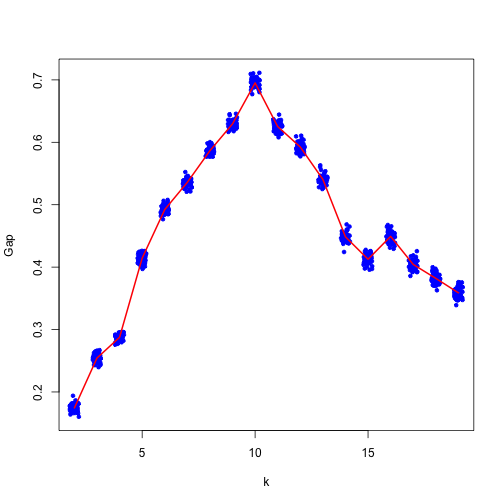

# ClockstaR-G

```
install.packages('devtools')
install_github('clockstar', 'sebastianduchene')
```

```
optim.trees.interactive()
```


```r
gene_trees <- read.tree('test_files/gene_trs.trees')
gene_trees
```

```
## 431 phylogenetic trees
```


```r
scaled_brlens <- get_scaled_brs(gene_trees)
scaled_brlens[1:5, 1:5]
```

```
##                      br1         br2         br3        br4        br5
## gene1.fasta    0.8744534 -0.94391517 -0.30614258 -0.7547649 -0.9224694
## gene10.fasta  -0.1115978 -0.64901645  0.34732223 -1.2503996  1.6364791
## gene100.fasta  0.5661995 -1.52203349 -0.66338113  0.6159581  1.9645646
## gene101.fasta  1.3220140 -0.11418356 -0.37096590  0.2638443 -0.9959751
## gene102.fasta -0.1406745  0.04542243 -0.02738257  1.8221301  2.1470487
```

```r
dim(scaled_brlens)
```

```
## [1] 431  55
```


```r
pms_gap <- optim_clusters_coord(scaled_brlens, n_clusters = 2, kmax = 19, b_reps = 50, out_cluster_id = 'cluster_id.txt', out_cluster_info = 'cluster_info.txt', out_gap_stats = 'gap_stats.txt', plot_clustering = T)
```

```
## bootstrap replicate 1 the average silhouete width is 0.0151784 
## bootstrap replicate 2 the average silhouete width is 0.019558 
## bootstrap replicate 3 the average silhouete width is 0.01945298 
## bootstrap replicate 4 the average silhouete width is 0.0166844 
## bootstrap replicate 5 the average silhouete width is 0.01925395 
## bootstrap replicate 6 the average silhouete width is 0.01587122 
## bootstrap replicate 7 the average silhouete width is 0.0180393 
## bootstrap replicate 8 the average silhouete width is 0.01865778 
## bootstrap replicate 9 the average silhouete width is 0.02146133 
## bootstrap replicate 10 the average silhouete width is 0.01774538 
## bootstrap replicate 11 the average silhouete width is 0.02103381 
## bootstrap replicate 12 the average silhouete width is 0.01263322 
## bootstrap replicate 13 the average silhouete width is 0.0123706 
## bootstrap replicate 14 the average silhouete width is 0.01994545 
## bootstrap replicate 15 the average silhouete width is 0.01568984 
## bootstrap replicate 16 the average silhouete width is 0.02088362 
## bootstrap replicate 17 the average silhouete width is 0.02288578 
## bootstrap replicate 18 the average silhouete width is 0.01733735 
## bootstrap replicate 19 the average silhouete width is 0.01741094 
## bootstrap replicate 20 the average silhouete width is 0.01894372 
## bootstrap replicate 21 the average silhouete width is 0.02011465 
## bootstrap replicate 22 the average silhouete width is 0.02202092 
## bootstrap replicate 23 the average silhouete width is 0.01233169 
## bootstrap replicate 24 the average silhouete width is 0.01678242 
## bootstrap replicate 25 the average silhouete width is 0.02269447 
## bootstrap replicate 26 the average silhouete width is 0.02107003 
## bootstrap replicate 27 the average silhouete width is 0.01564224 
## bootstrap replicate 28 the average silhouete width is 0.01336977 
## bootstrap replicate 29 the average silhouete width is 0.01560849 
## bootstrap replicate 30 the average silhouete width is 0.02338651 
## bootstrap replicate 31 the average silhouete width is 0.02419 
## bootstrap replicate 32 the average silhouete width is 0.01874042 
## bootstrap replicate 33 the average silhouete width is 0.01999893 
## bootstrap replicate 34 the average silhouete width is 0.01943811 
## bootstrap replicate 35 the average silhouete width is 0.02090956 
## bootstrap replicate 36 the average silhouete width is 0.01805155 
## bootstrap replicate 37 the average silhouete width is 0.0201716 
## bootstrap replicate 38 the average silhouete width is 0.01721855 
## bootstrap replicate 39 the average silhouete width is 0.01669835 
## bootstrap replicate 40 the average silhouete width is 0.02532568 
## bootstrap replicate 41 the average silhouete width is 0.02399091 
## bootstrap replicate 42 the average silhouete width is 0.02138286 
## bootstrap replicate 43 the average silhouete width is 0.02307345 
## bootstrap replicate 44 the average silhouete width is 0.01734929 
## bootstrap replicate 45 the average silhouete width is 0.01944513 
## bootstrap replicate 46 the average silhouete width is 0.02125033 
## bootstrap replicate 47 the average silhouete width is 0.01717928 
## bootstrap replicate 48 the average silhouete width is 0.02201287 
## bootstrap replicate 49 the average silhouete width is 0.01939233 
## bootstrap replicate 50 the average silhouete width is 0.02270565
```

 


